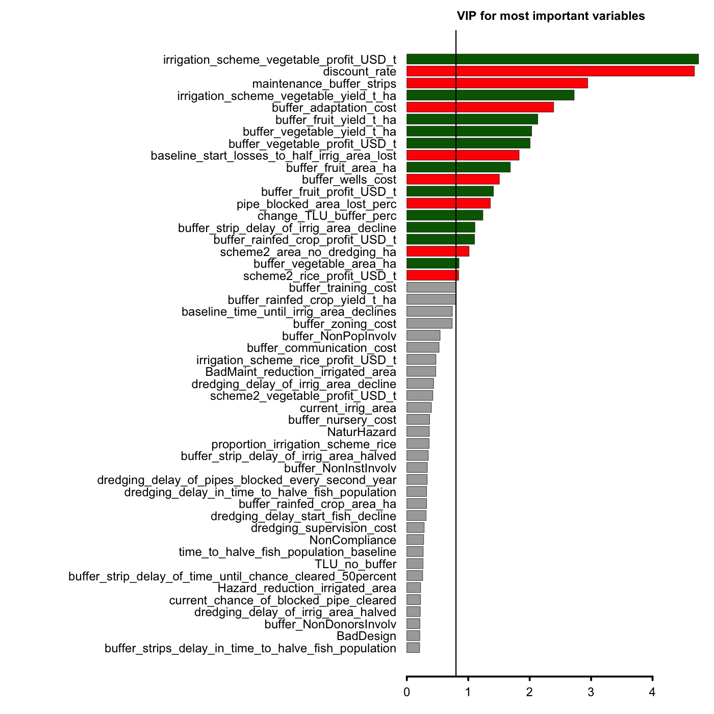

# Decision model for reservoir sedimentation management

Decision Analysis (DA) can be used to support practical decisions in the face of risk and uncertainty (Hubbard 2014; Howard & Abbas 2016). DA can generate robust and science-based decision support by integrating data and expert knowledge on decisions and the systems they strive to influence. We demonstrate DA model development techniques to support the difficult task of deciding which interventions to choose, if any, given a collection of possible interventions to implement. The approach embraces complexity, makes recommendations that account for the imperfect state of available knowledge and identifies critical uncertainties that decision-supporting research should address. Such decision analysis is highly applicable in data-scarce environments, such as the Upper Volta River Basin, where science has traditionally struggled to provide actionable information to policy-makers, development practitioners, NGOs and rural communities (Katic & Morris 2016). 

The ```decisionSupport()``` function is part of the package ```decisionSupport``` (Luedeling and Göhring, 2017) in the R programming environment (R Core Team 2017). This package was used for a Monte-Carlo-based selection of a sedimentation management strategy for a reservoir in Burkina Faso. These reservoirs have multiple benefits for rural communities (Cecchi et al. 2008; Bharati et al. 2008; Venot & Cecchi 2011; Boelee et al. 2013) and are important for food security and livelihoods (Palmieri et al. 2001; Wisser et al. 2010; Poussin et al. 2015). Sedimentation is a major impediment for the functioning of these reservoirs (Kondolf et al. 2014; Schmengler 2011; Chitata et al. 2014). The design of an efficient sedimentation management intervention for the reservoir of Lagdwenda required assessment of multiple uncertain quantities and risks. The reservoir is a good prototype for testing the strategies of sedimentation management in the Volta basin. Most of the reservoirs in the Upper Volta present similar conditions and context (climatic environment, type of crops cultivated, cultural practices and the sedimentation issue) (Birner et al 2010).

A number of specialized participatory approaches and modeling techniques helped us to construct and parameterize a model based on the knowledge of local expert stakeholders. These approaches are outlined, in part, by Allan et al (2010), David et al. (2014), Fred et al (2017), Morgan (2014), Martin et al (2012) and Samantha et al (2009).

```{r, child = 'Overview.Rmd'}
```

## Model structure

By coding a participatory conceptual model as a Monte Carlo simulation using the ```decisionSupport()``` function in the R package ```decisionSupport``` we were able to offer decision makers probable outcomes in terms of Net Present Value (NPV) and cash flow for the intervention decisions (including combined interventions) and to identify variables that most affected the overall outcome of the different decisions. 

{width=500px}

## Input table

The input table ```Sediment_input_table.csv``` contains the variables used in the model with distributions described by a 90% confidence interval, as well as the shape of the distribution. 

```{r, echo = FALSE, results = 'asis'}
#format(scientific=FALSE)
options(scipen=999)
library(knitr)
library(kableExtra)
options(knitr.kable.NA = " ") #remove NA
options(knitr.table.format = "html")
#x<-as.data.frame(read.csv("Sediment_input_table.csv"))
#x[is.na(x)] <- "_" #replace NA with underscore
knitr::kable(read.csv("Sediment_input_table_decriptions.csv"), caption = "Table of expert estimates for all model variables. The column 'distribution' lists the distribution shapes used, including constant (const), 0-1 truncated normal (tnorm_0_1), positive normal (posnorm) and normal (norm)")%>%
  kable_styling(full_width = T, font_size = 10)
```

```{r, include=FALSE}
library(decisionSupport)
make_variables<-function(est,n=1)
{ x<-random(rho=est, n=n)
for(i in colnames(x)) assign(i, as.numeric(x[1,i]),envir=.GlobalEnv)
}

make_variables(estimate_read_csv("Sediment_input_table.csv"))
```

# Implementing the model in R

To set up the analysis we first define the variable ```n_years``` to indicate the 30 year timeline for assessing the impacts of the intervention decision.

We define the probabilities of four ex-post risks (natural hazards, bad maintenance, and bad design) as possible impacts on the benefits probability, and three ex-ante risks (non-involvement of the local population, the institutions, and the donors) as possible impacts on the implementation of interventions. 

## Chance events

Certain events can either occur or not, and values for dependent variables can depend on which of the cases occurs. The ```chance_event()``` function  randomly simulates whether events occur and returns output values accordingly. The outputs can be single values or a series of values, with the option of introducing artificial variation into this dataset.

The identified ex-post and ex-ante risks were all assigned probability ranges from 0 to 1 and the ```chance_event()``` function was used to simulate a time series of their occurrence. The following lines of R code produce a series for the chance of the identified ex-ante or ex-post risk occurrences over 30 years (```n_years```). It simulates a random chance of the occurrence (value_if = 1) or not (value_if_not = 0) of the event. 

### Chance events and ex-ante risks

We used the ```chance_event()``` function for simulation of ex-ante risks as impacts on the implementation of the three interventions.

Probability distributions for the chance variables ```dredge_NonPopInvolv```, ```dredge_NonDonorsInvolv``` are defined in the input table ```Sediment_input_table.csv```.

#### Chance event of two ex-ante risks on the dredging intervention

```{r}
  dredge_NonPopInvolvEvent<-chance_event(dredge_NonPopInvolv,value_if = 1,value_if_not =0,n=1)
  dredge_NonDonorsInvolvEvent<-chance_event(dredge_NonDonorsInvolv,1,value_if_not =0,n=1)
```

The ex-ante risk of lack of donor involvement was not considered valid for the dredging. This is because the main investment for the dredging intervention would be labor that, in principle, would be donated by the local communities.

#### Chance event of three ex-ante risks on the rock check dams intervention

```{r}
  check_NonPopInvolvEvent<-chance_event(check_NonPopInvolv,value_if = 1,value_if_not =0,n=1)
  check_NonInstInvolvEvent<-chance_event(check_NonInstInvolv,value_if = 1,value_if_not =0,n=1)
  check_NonDonorsInvolvEvent<-chance_event(check_NonDonorsInvolv,value_if = 1,value_if_not = 0,n=1)
```

#### Chance event of three ex-ante risks on the buffer strips intervention

```{r} 

  buffer_NonPopInvolvEvent<-chance_event(buffer_NonPopInvolv,value_if = 1,value_if_not =0,n=1)
  buffer_NonInstInvolvEvent<-chance_event(buffer_NonInstInvolv,value_if = 1,value_if_not = 0,n=1)
  buffer_NonDonorsInvolvEvent<-chance_event(buffer_NonDonorsInvolv,value_if = 1,value_if_not = 0,n=1)
  
```

### Chance events and ex-post risks

We used the ```chance_event()``` function for simulation of the four ex-post risks as impacts on the benefits. Probability distributions for the chance variables ```NaturHazard```, ```BadMaintenance``` and ```BadDesign``` included in the code below, are all defined in the input table ```Sediment_input_table.csv```.

```{r}
  HazardEvent<-chance_event(NaturHazard,value_if = 1,value_if_not =0,n=n_years)
  BadMaintEvent<-chance_event(BadMaintenance,value_if = 1,value_if_not =0,n=n_years)
```

In the case of the ex-post risk of design problems (```BadDesign```) of the reservoir we used the option ```one_draw``` within the ```chance_event()``` function. ```one_draw``` is a boolean coefficient. By indicating that ```one_draw=TRUE``` the event occurrence ```BadDesign``` is determined only once with results applying to all elements of the results vector ```BadDesignEvent```.

```{r}
  BadDesignEvent<-chance_event(BadDesign,value_if = 1,value_if_not =0,n=n_years, one_draw = TRUE)
```


## Variability in estimates  

Many of the variables included in the model were considered to vary considerably over time and we chose to include this variation in the time series analyses. To do this we used the value varier function ```vv()``` to produce a time series that contains variation from a specified mean and coefficient of variation. 

The probability distributions for the mean of the variable to be varied (the first argument in the ```vv()``` function) and the coefficient of variation (```var_CV```) are listed among the variables in ```Sediment_input_table.csv```. ```var_CV``` is assigned an upper and lower bound (5% and 20%). 

The value varier function ```vv()``` was applied to the identified ex-ante risks on the irrigation area.

```{r}

  Hazard_scaling_irrig_area<-1-HazardEvent*vv(Hazard_reduction_irrigated_area,var_CV,n=n_years)/100
  BadMaint_scaling_irrig_area<-1-BadMaintEvent*vv(BadMaint_reduction_irrigated_area,var_CV,n=n_years)/100
  BadDesign_scaling_irrig_area<-1-BadDesignEvent*vv(BadDesign_reduction_irrigated_area,var_CV,n=n_years)/100
  
```

### Simulation of common random draws

We also used ```vv()``` for simulation  of common random draws for all intervention model runs.

#### Livestock

Livestock were calculated as Tropical Livestock Units (TLU), with the exclusion of the possibility of TLU inside the buffer zone if the buffer zone intervention was implemented. We used the ```vv()``` function to simulate expected variation in TLU and profits from TLU.

```{r}

  TLU<-vv(TLU_no_buffer,var_CV,n_years)
  TLU_profit<-vv(profit_per_TLU,var_CV,n_years)
  
```

#### Crops 

Crops were grown in two different areas, one formal irrigation scheme downstream of the dam and one informal cropping area upstream of the dam. 

{width=500px}

We used the ```vv()``` function to simulate expected variation crop benefits. Crop benefits were expected to vary with total cropping area (hectare) yields (ton per hectare) and profits (USD). 

#### Crops in the buffer zone 

**Fruits**
```{r}

  precalc_buffer_fruit_benefits<-vv(buffer_fruit_area_ha,var_CV,n_years)*
    vv(buffer_fruit_yield_t_ha,var_CV,n_years)*
    vv(buffer_fruit_profit_USD_t,var_CV,n_years)
```

**Vegetables**
```{r}

  precalc_buffer_vegetable_benefits<-vv(buffer_vegetable_area_ha,var_CV,n_years)*
    vv(buffer_vegetable_yield_t_ha,var_CV,n_years)*
    vv(buffer_vegetable_profit_USD_t,var_CV,n_years)
```

**Other rainfed crops** 
```{r}

    precalc_buffer_rainfed_crop_benefits<-vv(buffer_rainfed_crop_area_ha,var_CV,n_years)*
    vv(buffer_rainfed_crop_yield_t_ha,var_CV,n_years)*
    vv(buffer_rainfed_crop_profit_USD_t,var_CV,n_years)  

```

#### Crops in the informal cropping area (upstream)

```{r} 

  precalc_scheme2_vegetable_yield_t_ha<-vv(scheme2_vegetable_yield_t_ha,var_CV,n_years)
  precalc_scheme2_vegetable_profit_USD_t<-vv(scheme2_vegetable_profit_USD_t,var_CV,n_years)
  
  precalc_scheme2_rice_yield_t_ha<-vv(scheme2_rice_yield_t_ha,var_CV,n_years)
  precalc_scheme2_rice_profit_USD_t<-vv(scheme2_rice_profit_USD_t,var_CV,n_years)
  
```

#### Crops in the irrigation scheme (downstream)

**Vegetables** 
```{r} 

  precalc_irrigation_scheme_vegetable_yield_t_ha<-vv(irrigation_scheme_vegetable_yield_t_ha,var_CV,n_years)
  precalc_irrigation_scheme_vegetable_profit_USD_t<-vv(irrigation_scheme_vegetable_profit_USD_t,var_CV,n_years)
  
```

**Rice** 
```{r} 

  precalc_irrigation_scheme_rice_yield_t_ha<-vv(irrigation_scheme_rice_yield_t_ha,var_CV,n_years)
  precalc_irrigation_scheme_rice_profit_USD_t<-vv(irrigation_scheme_rice_profit_USD_t,var_CV,n_years)
  
  precalc_proportion_irrigation_scheme_rice<-vv(proportion_irrigation_scheme_rice,var_CV,n_years)  
  
```
  
#### Fish

We used the ```vv()``` function to simulate expected variation in benefits from fishing. The benefits from fishing were considered to vary according to ```var_CV```. Fish benefits were also expected to vary according to the possibility of natural hazards.

```{r} 

  precalc_fish_hazards<-HazardEvent*vv(Hazard_reduction_fish_perc/100,var_CV,n=n_years)
  precalc_current_fish_value<-vv(current_annual_fish_value_USD,var_CV,n_years)
 
```

## Intervention loop

We defined an intervention loop centered around the three interventions (dredging, rock check dams, and buffer strips) and their various combinations.

```{r, eval=FALSE} 

 for (decision_dredging in c(FALSE,TRUE))
    for (decision_check_dams in c(FALSE,TRUE))
      for (decision_buffer_strips in c(FALSE,TRUE))
```

### Dredging

The model was programmed so that the implementation of dredging intervention would incur the costs of planning and doing the work, if it is not implemented then there would be no related costs.

```{r, eval=FALSE} 
        if(decision_dredging)
        {dredging<-TRUE
        dredging_PlanningCost<-TRUE
        dredging_Cost<-TRUE} else
        {dredging<-FALSE
        dredging_PlanningCost<-FALSE
        dredging_Cost<-FALSE}
```

If the dredging intervention was chosen but the local populations did not get involved, the costs of planning the dredging would still be incurred, but the costs of dredging the channels would not, since the intervention would not go ahead. In the case of the dredging intervention the lack of institutional involvement was assumed to have no effect.
      
```{r, eval=FALSE} 
        
        if (dredge_NonPopInvolvEvent){ dredging<-FALSE ; dredging_Cost<-FALSE}
        if (dredge_NonDonorsInvolvEvent){ 
          dredging<-FALSE ; dredging_Cost<-FALSE ; dredging_PlanningCost<-FALSE}

```

### Rock check dams

The model was programmed so that the implementation of the rock check dam intervention incurs the costs of planning and doing the work, if it is not implemented then there would be no related costs.

```{r, eval=FALSE} 

        if(decision_check_dams)
        {check_dams<-TRUE
        check_dams_PlanningCost<-TRUE
        check_dams_Cost<-TRUE} else
        {check_dams<-FALSE
        check_dams_PlanningCost<-FALSE
        check_dams_Cost<-FALSE}
```

If the rock check dam intervention was chosen but either the local populations, institutions, or donors did not get involved, the costs of planning the rock  check dams would still be incurred, but the costs of building the rock check dams would not as the intervention would not go ahead.
      
```{r, eval=FALSE} 

        if (check_NonPopInvolvEvent){check_dams<-FALSE ; check_dams_Cost<-FALSE}
        if (check_NonInstInvolvEvent){check_dams<-FALSE ; check_dams_Cost<-FALSE}
        if (check_NonDonorsInvolvEvent){check_dams<-FALSE ; dredging_Cost<-FALSE ; check_dams_PlanningCost<-FALSE}
     
```

### Buffer strips

The model was programmed so that the implementation of the buffer strips incur the costs of planning and doing the work, if it is not implemented then there would be no related costs. 

```{r, eval=FALSE}    

        if(decision_buffer_strips)
        {buffer_strips<-TRUE
        buffer_strips_PlanningCost<-TRUE
        buffer_strips_Cost<-TRUE} else
        {buffer_strips<-FALSE
        buffer_strips_PlanningCost<-FALSE
        buffer_strips_Cost<-FALSE}
```

If the buffer strip intervention was chosen but either the local populations, institutions, or donors did not get involved, the costs of planning the buffer strips would still be incurred, but the costs of planting the buffer strips would not, since the intervention would not go ahead.
      
```{r, eval=FALSE}

        if (buffer_NonPopInvolvEvent){buffer_strips<-FALSE ; buffer_strips_Cost<-FALSE}
        if (buffer_NonInstInvolvEvent){buffer_strips<-FALSE ; buffer_strips_Cost<-FALSE}
        if (buffer_NonDonorsInvolvEvent){buffer_strips<-FALSE ; buffer_strips_Cost<-FALSE ; buffer_strips_PlanningCost<-FALSE}
        
```

### Costs of the interventions

All interventions had a number of costs that were identified by the local experts. The probability distributions for these are listed among the variables in ```Sediment_input_table.csv```.  

####Costs of dredging
```{r, eval=FALSE}         
        
        if(dredging_Cost) {cost_dredging<-dredging_supervision_cost+dredging_admin_cost+dredging_transport_cost+
          dredging_culvert_supervision_cost
        } else cost_dredging<-0 

```

####Costs of rock check dams
```{r, eval=FALSE}  

        if(check_dams_Cost) {cost_check_dams<-check_supervision_cost+check_training_cost+check_tech_devices_cost+check_material_cost+
          check_rocks_cost+check_transport_cost
        } else cost_check_dams<-0 
```

####Costs of buffer strips
```{r, eval=FALSE} 
        if(buffer_strips_Cost) {cost_buffer_strips<-buffer_adaptation_cost+buffer_tech_devices_cost+buffer_nursery_cost+buffer_wells_cost+
          buffer_training_cost+buffer_mngmt_oprt_cost+buffer_mngmt_follow_cost+buffer_mngmt_audit_cost
        } else cost_buffer_strips<-0 
```

####Costs of planning
```{r, eval=FALSE}        
        if(dredging_PlanningCost) {plan_cost_dredging<-dredging_study_cost+dredging_communication_cost+dredging_culvert_feasibility_cost
        } else plan_cost_dredging<-0 
        if(check_dams_PlanningCost) {plan_cost_check_dams<-check_location_cost+check_feasibility_cost+check_topobatymetry_cost+check_communication_cost
        } else plan_cost_check_dams<-0
        if(buffer_strips_PlanningCost) {plan_cost_buffer_strips<-buffer_communication_cost+buffer_zoning_cost
        } else plan_cost_buffer_strips<-0 
```

####Costs of maintenance
```{r, eval=FALSE}         
        maintenance_cost<-rep(0,n_years)
```

The ```vv()``` function was used to simulate the expected variation in the cost of maintenance for the rock check dams and buffer strip interventions.
```{r, eval=FALSE}          
        if(check_dams) maintenance_cost<-maintenance_cost+vv(maintenance_check_dams,var_CV,n_years)
        
        if(buffer_strips) maintenance_cost<-maintenance_cost+vv(maintenance_buffer_strips,var_CV,n_years)
```

####Costs of interventions
```{r, eval=FALSE}         
        intervention_cost<-maintenance_cost
        intervention_cost[1]<-intervention_cost[1]+cost_dredging+cost_check_dams+cost_buffer_strips+
          plan_cost_dredging+plan_cost_check_dams+plan_cost_buffer_strips
```

#### Decline in irrigable area over time

Because sediments accumulate in the reservoir, the dam gradually loses its capacity to store water, which may become a binding constraint for irrigation in the foreseeable future. Because of this, in the irrigation scheme downstream, the total irrigable area (area that can be irrigated given the water stock in the reservoir) was expected to decline over time. This decline in irrigable area would, however, be delayed by the various interventions. This was modeled as a sigmoid using the ```gompertz_yield``` function to simulate these delays in loss of irrigable area over time. 

The Gompertz equation is written as: 
f(t)=a • e^(-b • e^(-c • t)). 
In this formula “a” is the maximum asymptotic ‘yield’ value (provided as an input, in our case “max-harvest=1”) and “b” and “c” are two parameters that can be identified from a set of two equations with two unknowns. Concretely, rather than estimating them directly, we define the equation for two points in time, with user-estimated inputs, and then solve the equations for “b” and “c”. This means, we say that 
f(t1)=e^(-b • e^(-c • t1))=f1 
and 
f(t2)=e^(-b • e^(-c • t2))=f2
t1, t2, f1 and f2 are inputs (“a” is missing here, because we specify f1 and f2 as percentage of “a”, so that it drops out). These two equations with two unknowns can be solved mathematically to obtain “b” and “c”. That is what the Gompertz function does. 

```{r, eval=FALSE}         

gompertz_time1_time_until_irrigated_area_declines<-
  sum(c(baseline_time_until_irrig_area_declines,
          dredging*dredging_delay_of_irrig_area_decline,
          check_dams*check_dam_delay_of_irrig_area_decline,
          buffer_strips*buffer_strip_delay_of_irrig_area_decline))

gompertz_time2_time_until_irrigated_area_halved<-
  sum(c(gompertz_time1_time_until_irrigated_area_declines,
        baseline_start_losses_to_half_irrig_area_lost,
        dredging*dredging_delay_of_irrig_area_halved,
        check_dams*check_dam_delay_of_irrig_area_halved,
        buffer_strips*buffer_strip_delay_of_irrig_area_halved))
```

The Gompertz function for loss of irrigable area in the downstream irrigation area was applied using the variables defined above. The irrigable area was likely to be highest in the first few years, thus we called for the highest value in the first year ```max-harvest=1```. Following this, irrigation area would gradually decrease, starting from ``gompertz_time1_time_until_irrigated_area_declines`` until the irrigation area was lost by half  ```gompertz_time1_time_until_irrigated_area_declines ```.

```{r, eval=FALSE}         
irrig_scheme1_area_share<-
  1-gompertz_yield(max_harvest=1,
  time_to_first_yield_estimate=gompertz_time1_time_until_irrigated_area_declines,
  time_to_second_yield_estimate=gompertz_time2_time_until_irrigated_area_halved,
  first_yield_estimate_percent=10,
  second_yield_estimate_percent=50, 
  n_years=n_years, var_CV = 0,
  no_yield_before_first_estimate = TRUE)
```

We define a vector of the irrigation area over time from the output of the ```gompertz_yield``` function.

```{r, eval=FALSE}  

        irrig_scheme1_area_share<-irrig_scheme1_area_share[1:30]
        
        irrig_scheme1_area<-current_irrig_area*irrig_scheme1_area_share
        
```

### Irrigation pipe blockage and clearing

Downstream the reservoir, water supply is achieved through a system of pipes underneath the dam’s barrier that allow the irrigation scheme to be watered. Sediments regularly disrupt this system, blocking the pipes and preventing water from flowing into the agricultural area. Therefore, interventions that reduce sedimentation prevent the obstruction of pipes and generate benefits by securing irrigation use in the  scheme. We used the ```gompertz_yield``` function to represent the decline in the irrigated area over time. The blockage was likely to be low for a few years after starting the irrigation, following which blockages would gradually increase until the irrigation pipes were no longer operational.

```{r, eval=FALSE}         
        
gompertz_time2_time_until_pipe_blockage_occurs_every_second_year<-
  sum(c(baseline_time_until_pipes_blocked_every_second_year,
       dredging*dredging_delay_of_pipes_blocked_every_second_year,
       check_dams*check_dam_delay_of_pipes_blocked_every_second_year,
       buffer_strips*buffer_strip_delay_of_pipes_blocked_every_second_year))

```

We used the ```gompertz_yield``` function to define the risk of pipe blockage.

```{r, eval=FALSE}
        
risk_blockage<-gompertz_yield(max_harvest=1,
                                      time_to_first_yield_estimate=0,
                                      time_to_second_yield_estimate=gompertz_time2_time_until_pipe_blockage_occurs_every_second_year,
                                      first_yield_estimate_percent=100*current_risk_of_pipe_blockage,
                                      second_yield_estimate_percent=50,
                                      n_years=n_years, var_CV = 0,
                                      no_yield_before_first_estimate = TRUE)
        risk_blockage[which(risk_blockage>1)]<-1
        risk_blockage[which(risk_blockage<0)]<-0
```

We defined the ```time_to_second_yield_estimate``` for the ```gompertz_yield``` function by adding together the amount of time that the different interventions delay the pipe blockage given their occurrence. 

```{r, eval=FALSE}   

gompertz_time2_time_until_chance_cleared_50percent<-
  sum(c(baseline_time_until_chance_cleared_50percent,
    dredging*dredging_delay_of_time_until_chance_cleared_50percent,
    check_dams*check_dam_delay_of_time_until_chance_cleared_50percent,
    buffer_strips*buffer_strip_delay_of_time_until_chance_cleared_50percent))
 
```

We used the ```gompertz_yield``` function to define the chance of pipes being cleared.

```{r, eval=FALSE}   

chance_cleared<-gompertz_yield(max_harvest=1,
       time_to_first_yield_estimate=0,
       time_to_second_yield_estimate=gompertz_time2_time_until_chance_cleared_50percent,
       first_yield_estimate_percent=100*current_chance_of_blocked_pipe_cleared,
       second_yield_estimate_percent=50,
       n_years=n_years, var_CV = 10,
       no_yield_before_first_estimate = TRUE)
```

We then bound the chance of being cleared to between '0' and '1'.

```{r, eval=FALSE}  
        chance_cleared[which(chance_cleared>1)]<-1
        chance_cleared[which(chance_cleared<0)]<-0
        
```

#### Creation of intermediate variables

##### Area irrigated
We then created intermediate variables to calculate the area potentially irrigated, in the formal irrigation scheme, given the risk that pipes are blocked and/or cleared.
        
```{r, eval=FALSE}         
        
        pipe_clogging<-sapply(1:n_years,function(x) rbinom(1,1,risk_blockage[x]))
        pipe_cleared<-sapply(1:n_years,function(x) rbinom(1,1,chance_cleared[x]))
        
        pipe_blocked <- pipe_clogging
        for (i in 2:length(pipe_blocked))
          if (pipe_clogging[i] == 0) 
            if (pipe_blocked[i - 1] == 1) 
              if (!pipe_cleared[i] == 1) pipe_blocked[i] <- 1
```

##### Area lost to pipe blockage
We used the ```vv()``` function to simulate the ex-ante risks of formal irrigation area lost to pipe blockage.

```{r, eval=FALSE}  

        irrig_scheme1_irrigated_area_ex_ante<-irrig_scheme1_area*(1-pipe_blocked*vv(pipe_blocked_area_lost_perc/100,var_CV,n_years))
  
        irrigated_area_scheme1<-irrig_scheme1_irrigated_area_ex_ante*
          Hazard_scaling_irrig_area*BadMaint_scaling_irrig_area*
          BadDesign_scaling_irrig_area 
```

##### Benefits from rice cultivation
We then calculated the benefits from rice cultivation on the shore of the reservoir. 
These were set to '0' if buffer strips were implemented.

```{r, eval=FALSE}          
        
        if (buffer_strips)
          buffer_strip_cultivation<-TRUE else buffer_strip_cultivation<-FALSE
```

We then defined the time until the benefits from rice cultivation on the shore of the reservoir were gone by adding the baseline case to the benefits from rock check dams.

```{r, eval=FALSE}      

scheme2_time_until_benefits_gone<-
  scheme2_time_until_dredging_benefits_gone_baseline+
        check_dams*check_dams_added_scheme2_area_benefit_time
```

We then used the ```gompertz_yield``` function to calculate the benefits from rice cultivation on the shore of the reservoir. These were set to '0' if buffer strips were implemented.

```{r, eval=FALSE}
        
scheme2_area_scaler<-gompertz_yield(max_harvest=1,
                   time_to_first_yield_estimate=1,
                   time_to_second_yield_estimate=scheme2_time_until_benefits_gone,
                   first_yield_estimate_percent=100,
                   second_yield_estimate_percent=0,
                   n_years=n_years, var_CV = 0,
                   no_yield_before_first_estimate = TRUE)
```

We used the output of the ```gompertz_yield``` function to calculate the area of the informal cropping area.

```{r, eval=FALSE}   

scheme2_area_ha<-scheme2_area_no_dredging_ha*(1+
    dredging*scheme2_area_scaler*dredging_bump_scheme2_area_perc/100)

```

With the exception of a small bump in yields from the dredging intervention, the total area of rice cultivation in the informal cropping scheme was expected to remain unchanged. This is because the water needed for rice cultivation is easily accessible in the rainy season.

The ```vv()``` function was used to simulate the variability in the rice benefits from the informal cropping area. In the case that the buffer strip intervention was implemented we expected no informal cropping area, as this would be within the buffer zone.
        
```{r, eval=FALSE}        
  
        scheme2_rice_benefits<-as.numeric(!buffer_strips)*
          vv(scheme2_area_ha,var_CV,n_years)*
          precalc_scheme2_rice_yield_t_ha*
          precalc_scheme2_rice_profit_USD_t

```

##### Time until irrigation areas decline
The time until irrigation areas begin to decline in the informal cropping area as well as the time at which they have declined by half were defined for use in the ```gompertz_yield``` function.
        
```{r, eval=FALSE}  

gompertz_time1_time_until_irrigated_area2_declines<-sum(c(baseline_time_until_irrig_area2_declines,
                      dredging*dredging_delay_of_irrig_area2_decline,
                      check_dams*check_dam_delay_of_irrig_area2_decline))

gompertz_time2_time_until_irrigated_area2_halved<-
                       sum(c(gompertz_time1_time_until_irrigated_area2_declines,
                       baseline_start_losses_to_half_irrig_area2_lost,
                       dredging*dredging_delay_of_irrig_area2_halved,
                       check_dams*check_dam_delay_of_irrig_area2_halved))
```

##### Time until informal cropping areas decline
The ```gompertz_yield``` function was used to simulate the decline of the informal cropping area overtime.

```{r, eval=FALSE}        

irrig_scheme2_area_share<-
    1-gompertz_yield(max_harvest=1,
    time_to_first_yield_estimate=gompertz_time1_time_until_irrigated_area2_declines,
    time_to_second_yield_estimate=gompertz_time2_time_until_irrigated_area2_halved,
    first_yield_estimate_percent=0,
    second_yield_estimate_percent=50, n_years=n_years, var_CV = 0,
    no_yield_before_first_estimate = TRUE)
```

The outputs (declines in cropping area) from the ```gompertz_yield``` function were used to calculate the informal cropping area by multiplying by the original estimated informal cropping area ```scheme2_area_ha``` defined in the input table ```Sediment_input_table.csv```.

```{r, eval=FALSE}   
        
        scheme2_vegetable_area_ha<-scheme2_area_ha*irrig_scheme2_area_share

```

##### Benefits of informal cropping
These were then used to calculate the benefits of crop production in the informal cropping area.

```{r, eval=FALSE}  

scheme2_vegetable_benefits<-as.numeric(!buffer_strips)*
          vv(scheme2_vegetable_area_ha,var_CV,n_years)*
          precalc_scheme2_vegetable_yield_t_ha*
          precalc_scheme2_vegetable_profit_USD_t
        
buffer_fruit_benefits<-as.numeric(buffer_strips)*precalc_buffer_fruit_benefits
buffer_vegetable_benefits<-as.numeric(buffer_strips)*precalc_buffer_vegetable_benefits
buffer_rainfed_crop_benefits<-as.numeric(buffer_strips)*precalc_buffer_rainfed_crop_benefits
        
rainy_season_rice_area_scheme1<-
        irrigated_area_scheme1*precalc_proportion_irrigation_scheme_rice
        rainy_season_vegetable_area_scheme1<-irrigated_area_scheme1-rainy_season_rice_area_scheme1
        
irrigation_season_rainy_season_benefits_scheme1<-rainy_season_rice_area_scheme1*
          precalc_irrigation_scheme_rice_yield_t_ha*
          precalc_irrigation_scheme_rice_profit_USD_t+
          rainy_season_vegetable_area_scheme1*
          precalc_irrigation_scheme_vegetable_yield_t_ha*
          precalc_irrigation_scheme_vegetable_profit_USD_t
        
irrigation_season_dry_season_benefits_scheme1<-irrigated_area_scheme1*
          precalc_irrigation_scheme_vegetable_yield_t_ha*
          precalc_irrigation_scheme_vegetable_profit_USD_t

```

### Total benefits of crop production
The total benefits of crop production were defined by adding all the benefits of agricultural production in the formal and informal cropping area and in the buffer zone.
        
```{r, eval=FALSE}                 
   
crop_production<-scheme2_rice_benefits+
          scheme2_vegetable_benefits+
          buffer_fruit_benefits+
          buffer_vegetable_benefits+
          buffer_rainfed_crop_benefits+
          irrigation_season_rainy_season_benefits_scheme1+
          irrigation_season_dry_season_benefits_scheme1
 
```

#### Time to declinng fish population
The amount of time to the fish population beginning to decline and the time it takes for the fish population to decline by half were defined for use in the ```gompertz_yield``` function. 

```{r, eval=FALSE}        
        
time_to_start_fish_decline<-sum(c(time_to_start_fish_decline_baseline,
                        dredging_delay_start_fish_decline,
                        check_dams_delay_start_fish_decline,
                        buffer_strips_delay_start_fish_decline))
        
time_to_fish_population_halved<-sum(c(time_to_start_fish_decline,
                       time_to_halve_fish_population_baseline,
                       dredging_delay_in_time_to_halve_fish_population,
                       check_dams_delay_in_time_to_halve_fish_population,
                       buffer_strips_delay_in_time_to_halve_fish_population))
```

##### Declining fish benefits
The ```gompertz_yield``` function was used to simulate the decline in benefits from fishing overtime.

```{r, eval=FALSE}  

fish_benefit_scaler<-
    1-gompertz_yield(max_harvest=1,
    time_to_first_yield_estimate=time_to_start_fish_decline,
    time_to_second_yield_estimate=time_to_fish_population_halved,
    first_yield_estimate_percent=0,
    second_yield_estimate_percent=50, n_years=n_years, var_CV = 10,
    no_yield_before_first_estimate = TRUE)
```

The outputs from the ```gompertz_yield``` function were used to calculate the risk adjusted benefits from fishing in the reservoir.

```{r, eval=FALSE}   

        risk_adjusted_fish_benefits<-fish_benefit_scaler*(1-precalc_fish_hazards)

```

The risk adjusted benefits from fishing were then used to calculate the benefits from fishing in the reservoir.

```{r, eval=FALSE}        

        Fish_benefits<-precalc_current_fish_value*risk_adjusted_fish_benefits

```

#### Livestock benefits

Benefits from additional livestock rearing through access to the reservoir were calculated by subtracting the TLU change if the buffer strip intervention is implemented. Buffer strips were expected to restrict access to the reservoir for livestock and thus reduce TLU.
        
```{r, eval=FALSE} 

if(buffer_strips)  TLU_intervention<-
  TLU*(1+change_TLU_buffer_perc/100) 
  else TLU_intervention<-TLU

```

Benefits from additional livestock rearing through access to the reservoir were calculated as total TLU multiplied by profit per unit. 

```{r, eval=FALSE} 

        livestock_benefits<-TLU_intervention*TLU_profit

```

#### Total benefits final calculation

Total benefits were then calculated as the benefits of crop production plus benefits of fishing and benefits of keeping livestock.
        
```{r, eval=FALSE} 

        total_benefits<-crop_production+Fish_benefits+livestock_benefits

```

### Net benefits
Finally the net benefits were calculated by subtracting the intervention costs from the total benefits.
        
```{r, eval=FALSE} 
      
        net_benefits<-total_benefits-intervention_cost
        
        if(decision_dredging & decision_check_dams & decision_buffer_strips) result_dredge_check_buff<-net_benefits
        if(decision_dredging & decision_check_dams & !decision_buffer_strips) result_dredge_check_nbuff<-net_benefits
        if(decision_dredging & !decision_check_dams & decision_buffer_strips) result_dredge_ncheck_buff<-net_benefits
        if(decision_dredging & !decision_check_dams & !decision_buffer_strips) result_dredge_ncheck_nbuff<-net_benefits
        if(!decision_dredging & decision_check_dams & decision_buffer_strips) result_ndredge_check_buff<-net_benefits
        if(!decision_dredging & decision_check_dams & !decision_buffer_strips) result_ndredge_check_nbuff<-net_benefits
        if(!decision_dredging & !decision_check_dams & decision_buffer_strips) result_ndredge_ncheck_buff<-net_benefits
        if(!decision_dredging & !decision_check_dams & !decision_buffer_strips) result_ndredge_ncheck_nbuff<-net_benefits

```

#### Adjusted net benefits
The ```discount``` function was used to adjust the net benefits for time preference. With the attribute ```calculate_NPV()```, the function automatically calculates the Net Present Value (the sum of discounted values)

```{r, eval=FALSE} 

 NPV_dredge_check_buff<-discount(result_dredge_check_buff,discount_rate,calculate_NPV = TRUE)
  NPV_dredge_check_nbuff<-discount(result_dredge_check_nbuff,discount_rate,calculate_NPV = TRUE)
  NPV_dredge_ncheck_buff<-discount(result_dredge_ncheck_buff,discount_rate,calculate_NPV = TRUE)
  NPV_dredge_ncheck_nbuff<-discount(result_dredge_ncheck_nbuff,discount_rate,calculate_NPV = TRUE)
  NPV_ndredge_check_buff<-discount(result_ndredge_check_buff,discount_rate,calculate_NPV = TRUE)
  NPV_ndredge_check_nbuff<-discount(result_ndredge_check_nbuff,discount_rate,calculate_NPV = TRUE)
  NPV_ndredge_ncheck_buff<-discount(result_ndredge_ncheck_buff,discount_rate,calculate_NPV = TRUE)
  NPV_ndredge_ncheck_nbuff<-discount(result_ndredge_ncheck_nbuff,discount_rate,calculate_NPV = TRUE)
  
```

#### NPV and cash flow
The final lines of the function call for a list of NPV and cash flow for all interventions and combinations of interventions.  

```{r, eval=FALSE} 
  
  return(list(NPV_dredge_check_buff=NPV_dredge_check_buff-NPV_ndredge_ncheck_nbuff,
              NPV_dredge_check_nbuff=NPV_dredge_check_nbuff-NPV_ndredge_ncheck_nbuff,
              NPV_dredge_ncheck_buff=NPV_dredge_ncheck_buff-NPV_ndredge_ncheck_nbuff,
              NPV_dredge_ncheck_nbuff=NPV_dredge_ncheck_nbuff-NPV_ndredge_ncheck_nbuff,
              NPV_ndredge_check_buff=NPV_ndredge_check_buff-NPV_ndredge_ncheck_nbuff,
              NPV_ndredge_check_nbuff=NPV_ndredge_check_nbuff-NPV_ndredge_ncheck_nbuff,
              NPV_ndredge_ncheck_buff=NPV_ndredge_ncheck_buff-NPV_ndredge_ncheck_nbuff))

```

# R function (decision model)

The full R function (decision model) for the sediment intervention decision is given below. It calculates the Net Present Value (NPV) and cash flow for the implementation of the three identified sediment management options. The decision model function is named ```sediment_calc```. This function receives values for all the variables specified in the input table ```Sediment_input_table.csv```. 

```{r, eval=FALSE} 

sediment_calc<-function(x, varnames)
{
  
  ### 4 ex-post risks, impacts on the benefits
  HazardEvent<-chance_event(NaturHazard,1,0,n=n_years)
  BadMaintEvent<-chance_event(BadMaintenance,1,0,n=n_years)
  BadDesignEvent<-chance_event(BadDesign,1,0,n=n_years, one_draw = TRUE)
  
  Hazard_scaling_irrig_area<-
    1-HazardEvent*vv(Hazard_reduction_irrigated_area,var_CV,n=n_years)/100
  BadMaint_scaling_irrig_area<-
    1-BadMaintEvent*vv(BadMaint_reduction_irrigated_area,var_CV,n=n_years)/100
  BadDesign_scaling_irrig_area<-
    1-BadDesignEvent*vv(BadDesign_reduction_irrigated_area,var_CV,n=n_years)/100
  
  ### 3 ex-ante risks, impacts on the implementation of interventions
  dredge_NonPopInvolvEvent<-chance_event(dredge_NonPopInvolv,1,0,n=1)
  dredge_NonDonorsInvolvEvent<-chance_event(dredge_NonDonorsInvolv,1,0,n=1)
  
  check_NonPopInvolvEvent<-chance_event(check_NonPopInvolv,1,0,n=1)
  check_NonInstInvolvEvent<-chance_event(check_NonInstInvolv,1,0,n=1)
  check_NonDonorsInvolvEvent<-chance_event(check_NonDonorsInvolv,1,0,n=1)
  
  buffer_NonPopInvolvEvent<-chance_event(buffer_NonPopInvolv,1,0,n=1)
  buffer_NonInstInvolvEvent<-chance_event(buffer_NonInstInvolv,1,0,n=1)
  buffer_NonDonorsInvolvEvent<-chance_event(buffer_NonDonorsInvolv,1,0,n=1)
  
  ##calculation of common random draws for all intervention model runs
  
  TLU<-vv(TLU_no_buffer,var_CV,n_years)
  TLU_profit<-vv(profit_per_TLU,var_CV,n_years)
  
  precalc_buffer_fruit_benefits<-vv(buffer_fruit_area_ha,var_CV,n_years)*
    vv(buffer_fruit_yield_t_ha,var_CV,n_years)*
    vv(buffer_fruit_profit_USD_t,var_CV,n_years)
  precalc_buffer_vegetable_benefits<-vv(buffer_vegetable_area_ha,var_CV,n_years)*
    vv(buffer_vegetable_yield_t_ha,var_CV,n_years)*
    vv(buffer_vegetable_profit_USD_t,var_CV,n_years)
  precalc_buffer_rainfed_crop_benefits<-vv(buffer_rainfed_crop_area_ha,var_CV,n_years)*
    vv(buffer_rainfed_crop_yield_t_ha,var_CV,n_years)*
    vv(buffer_rainfed_crop_profit_USD_t,var_CV,n_years)                                 
  precalc_scheme2_vegetable_yield_t_ha<-vv(scheme2_vegetable_yield_t_ha,var_CV,n_years)
  precalc_scheme2_vegetable_profit_USD_t<-vv(scheme2_vegetable_profit_USD_t,var_CV,n_years)
  
  precalc_scheme2_rice_yield_t_ha<-vv(scheme2_rice_yield_t_ha,var_CV,n_years)
  precalc_scheme2_rice_profit_USD_t<-vv(scheme2_rice_profit_USD_t,var_CV,n_years)
  
  precalc_irrigation_scheme_vegetable_yield_t_ha<-
    vv(irrigation_scheme_vegetable_yield_t_ha,var_CV,n_years)
  precalc_irrigation_scheme_vegetable_profit_USD_t<-
    vv(irrigation_scheme_vegetable_profit_USD_t,var_CV,n_years)
  
  precalc_irrigation_scheme_rice_yield_t_ha<-
    vv(irrigation_scheme_rice_yield_t_ha,var_CV,n_years)
  precalc_irrigation_scheme_rice_profit_USD_t<-
    vv(irrigation_scheme_rice_profit_USD_t,var_CV,n_years)
  
  precalc_proportion_irrigation_scheme_rice<-
    vv(proportion_irrigation_scheme_rice,var_CV,n_years)  
  
  precalc_fish_hazards<-HazardEvent*vv(Hazard_reduction_fish_perc/100,var_CV,n=n_years)
  precalc_current_fish_value<-vv(current_annual_fish_value_USD,var_CV,n_years)
  
  for (decision_dredging in c(FALSE,TRUE))
    for (decision_check_dams in c(FALSE,TRUE))
      for (decision_buffer_strips in c(FALSE,TRUE))
      {
        ###  Intervention 1: dredging
        if(decision_dredging)
        {dredging<-TRUE
        dredging_PlanningCost<-TRUE
        dredging_Cost<-TRUE} else
        {dredging<-FALSE
        dredging_PlanningCost<-FALSE
        dredging_Cost<-FALSE}
        
        if (dredge_NonPopInvolvEvent){ dredging<-FALSE ; dredging_Cost<-FALSE}
        # Non institutional involvement is assumed to have no  effect  #
        if (dredge_NonDonorsInvolvEvent){ dredging<-FALSE ; dredging_Cost<-FALSE ; dredging_PlanningCost<-FALSE}
        
        ###  Intervention 2: check_dams
        if(decision_check_dams)
        {check_dams<-TRUE
        check_dams_PlanningCost<-TRUE
        check_dams_Cost<-TRUE} else
        {check_dams<-FALSE
        check_dams_PlanningCost<-FALSE
        check_dams_Cost<-FALSE}
        
        if (check_NonPopInvolvEvent){check_dams<-FALSE ; check_dams_Cost<-FALSE}
        if (check_NonInstInvolvEvent){check_dams<-FALSE ; check_dams_Cost<-FALSE}
        if (check_NonDonorsInvolvEvent){check_dams<-FALSE ; dredging_Cost<-FALSE ; check_dams_PlanningCost<-FALSE}
        
        ###  Intervention 3: buffer_strips
        if(decision_buffer_strips)
        {buffer_strips<-TRUE
        buffer_strips_PlanningCost<-TRUE
        buffer_strips_Cost<-TRUE} else
        {buffer_strips<-FALSE
        buffer_strips_PlanningCost<-FALSE
        buffer_strips_Cost<-FALSE}
        
        if (buffer_NonPopInvolvEvent){buffer_strips<-FALSE ; buffer_strips_Cost<-FALSE}
        if (buffer_NonInstInvolvEvent){buffer_strips<-FALSE ; buffer_strips_Cost<-FALSE}
        if (buffer_NonDonorsInvolvEvent){buffer_strips<-FALSE ; buffer_strips_Cost<-FALSE ; buffer_strips_PlanningCost<-FALSE}
        
        ###Costs
        if(dredging_Cost) {cost_dredging<-
          dredging_supervision_cost+dredging_admin_cost+dredging_transport_cost+
          dredging_culvert_supervision_cost
        } else cost_dredging<-0 
        if(check_dams_Cost) {cost_check_dams<-
          check_supervision_cost+check_training_cost+check_tech_devices_cost+
          check_material_cost+
          check_rocks_cost+check_transport_cost
        } else cost_check_dams<-0 
        if(buffer_strips_Cost) {cost_buffer_strips<-
          buffer_adaptation_cost+buffer_tech_devices_cost+buffer_nursery_cost+
          buffer_wells_cost+
          buffer_training_cost+buffer_mngmt_oprt_cost+buffer_mngmt_follow_cost+
          buffer_mngmt_audit_cost
        } else cost_buffer_strips<-0 
        
        if(dredging_PlanningCost) {plan_cost_dredging<-
          dredging_study_cost+dredging_communication_cost+
          dredging_culvert_feasibility_cost
        } else plan_cost_dredging<-0 
        if(check_dams_PlanningCost) {plan_cost_check_dams<-
          check_location_cost+check_feasibility_cost+check_topobatymetry_cost+
          check_communication_cost
        } else plan_cost_check_dams<-0
        if(buffer_strips_PlanningCost) {plan_cost_buffer_strips<-buffer_communication_cost+buffer_zoning_cost
        } else plan_cost_buffer_strips<-0 
        
        maintenance_cost<-rep(0,n_years)
        
        if(check_dams) maintenance_cost<-maintenance_cost+vv(maintenance_check_dams,var_CV,n_years)
        
        if(buffer_strips) maintenance_cost<-maintenance_cost+vv(maintenance_buffer_strips,var_CV,n_years)
        
        intervention_cost<-maintenance_cost
        intervention_cost[1]<-intervention_cost[1]+cost_dredging+cost_check_dams+cost_buffer_strips+
          plan_cost_dredging+plan_cost_check_dams+plan_cost_buffer_strips
        
###irrigation scheme 1 - area decline and delay by interventions

gompertz_time1_time_until_irrigated_area_declines<-
            sum(c(baseline_time_until_irrig_area_declines,
            dredging*dredging_delay_of_irrig_area_decline,
            check_dams*check_dam_delay_of_irrig_area_decline,
            buffer_strips*buffer_strip_delay_of_irrig_area_decline))
        
gompertz_time2_time_until_irrigated_area_halved<-
          sum(c(gompertz_time1_time_until_irrigated_area_declines,
          baseline_start_losses_to_half_irrig_area_lost,
          dredging*dredging_delay_of_irrig_area_halved,
          check_dams*check_dam_delay_of_irrig_area_halved,
          buffer_strips*buffer_strip_delay_of_irrig_area_halved))
        
irrig_scheme1_area_share<-1-gompertz_yield(max_harvest=1,
        time_to_first_yield_estimate=gompertz_time1_time_until_irrigated_area_declines,
        time_to_second_yield_estimate=gompertz_time2_time_until_irrigated_area_halved,
        first_yield_estimate_percent=10,
        second_yield_estimate_percent=50, n_years=n_years, var_CV = 0,
        no_yield_before_first_estimate = TRUE)
        
irrig_scheme1_area_share<-irrig_scheme1_area_share[1:30]
        irrig_scheme1_area<-current_irrig_area*irrig_scheme1_area_share
        
###irrigation scheme 1 - risk of blockage and pipe clearing
        
gompertz_time2_time_until_pipe_blockage_occurs_every_second_year<-
    sum(c(baseline_time_until_pipes_blocked_every_second_year,
    dredging*dredging_delay_of_pipes_blocked_every_second_year,
    check_dams*check_dam_delay_of_pipes_blocked_every_second_year,
    buffer_strips*buffer_strip_delay_of_pipes_blocked_every_second_year))
    risk_blockage<-gompertz_yield(max_harvest=1,
    time_to_first_yield_estimate=0,
    time_to_second_yield_estimate=gompertz_time2_time_until_pipe_blockage_occurs_every_second_year,
    first_yield_estimate_percent=100*current_risk_of_pipe_blockage,
    second_yield_estimate_percent=50,
    n_years=n_years, var_CV = 0,
    no_yield_before_first_estimate = TRUE)
        
    risk_blockage[which(risk_blockage>1)]<-1
        risk_blockage[which(risk_blockage<0)]<-0
        
gompertz_time2_time_until_chance_cleared_50percent<-
          sum(c(baseline_time_until_chance_cleared_50percent,
          dredging*dredging_delay_of_time_until_chance_cleared_50percent,
          check_dams*check_dam_delay_of_time_until_chance_cleared_50percent,
          buffer_strips*buffer_strip_delay_of_time_until_chance_cleared_50percent))
        
chance_cleared<-gompertz_yield(max_harvest=1,
            time_to_first_yield_estimate=0,
             time_to_second_yield_estimate=gompertz_time2_time_until_chance_cleared_50percent,
            first_yield_estimate_percent=100*current_chance_of_blocked_pipe_cleared,
            second_yield_estimate_percent=50,
            n_years=n_years, var_CV = 10,
            no_yield_before_first_estimate = TRUE)

        chance_cleared[which(chance_cleared>1)]<-1
        chance_cleared[which(chance_cleared<0)]<-0
        
### Creation of intermediate variables
        
        pipe_clogging<-sapply(1:n_years,function(x) rbinom(1,1,risk_blockage[x]))
        pipe_cleared<-sapply(1:n_years,function(x) rbinom(1,1,chance_cleared[x]))
        
        pipe_blocked <- pipe_clogging
        for (i in 2:length(pipe_blocked))
          if (pipe_clogging[i] == 0) 
            if (pipe_blocked[i - 1] == 1) 
              if (!pipe_cleared[i] == 1) pipe_blocked[i] <- 1
        
        irrig_scheme1_irrigated_area_ex_ante<-
          irrig_scheme1_area*(1-pipe_blocked*vv(pipe_blocked_area_lost_perc/100,var_CV,n_years))
        
### Impact of ex-post risks on irrigated area
        irrigated_area_scheme1<-irrig_scheme1_irrigated_area_ex_ante*
          Hazard_scaling_irrig_area*BadMaint_scaling_irrig_area*
          BadDesign_scaling_irrig_area 
        
### Benefits from rice cultivation on the shore of the reservoir (==0 if buffer strips implemented)
        if (buffer_strips)
          buffer_strip_cultivation<-TRUE else buffer_strip_cultivation<-FALSE
        
        scheme2_time_until_benefits_gone<-scheme2_time_until_dredging_benefits_gone_baseline+
          check_dams*check_dams_added_scheme2_area_benefit_time
        
        scheme2_area_scaler<-gompertz_yield(max_harvest=1,
             time_to_first_yield_estimate=1,
              time_to_second_yield_estimate=scheme2_time_until_benefits_gone,
              first_yield_estimate_percent=100,
              second_yield_estimate_percent=0,
              n_years=n_years, var_CV = 0,
              no_yield_before_first_estimate = TRUE)
        
        scheme2_area_ha<-scheme2_area_no_dredging_ha*(1+
              dredging*scheme2_area_scaler*dredging_bump_scheme2_area_perc/100)
        
#rice area remains unchanged (except dredging bump)
        scheme2_rice_benefits<-as.numeric(!buffer_strips)*
          vv(scheme2_area_ha,var_CV,n_years)*
          precalc_scheme2_rice_yield_t_ha*
          precalc_scheme2_rice_profit_USD_t
        
gompertz_time1_time_until_irrigated_area2_declines<-
  sum(c(baseline_time_until_irrig_area2_declines,
        dredging * dredging_delay_of_irrig_area2_decline,
        check_dams * check_dam_delay_of_irrig_area2_decline))

gompertz_time2_time_until_irrigated_area2_halved<-
  sum(c(gompertz_time1_time_until_irrigated_area2_declines,
  baseline_start_losses_to_half_irrig_area2_lost,
  dredging * dredging_delay_of_irrig_area2_halved,
  check_dams *check_dam_delay_of_irrig_area2_halved))
        
irrig_scheme2_area_share<-1-gompertz_yield(max_harvest = 1,
                                           time_to_first_yield_estimate =
                                           gompertz_time1_time_until_irrigated_area2_declines,
                                           time_to_second_yield_estimate =
                                           gompertz_time2_time_until_irrigated_area2_halved,
                                           first_yield_estimate_percent = 0,
                                           second_yield_estimate_percent = 50, 
                                           n_years = n_years, var_CV = 0,
                                           no_yield_before_first_estimate = TRUE)
        
scheme2_vegetable_area_ha<-scheme2_area_ha*irrig_scheme2_area_share
        
scheme2_vegetable_benefits<-as.numeric(!buffer_strips)*
          vv(scheme2_vegetable_area_ha,var_CV,n_years)*
          precalc_scheme2_vegetable_yield_t_ha*
          precalc_scheme2_vegetable_profit_USD_t
        
buffer_fruit_benefits<-as.numeric(buffer_strips)*precalc_buffer_fruit_benefits
buffer_vegetable_benefits<-as.numeric(buffer_strips)*precalc_buffer_vegetable_benefits
buffer_rainfed_crop_benefits<-as.numeric(buffer_strips)*precalc_buffer_rainfed_crop_benefits
        
        
rainy_season_rice_area_scheme1<-
        irrigated_area_scheme1*precalc_proportion_irrigation_scheme_rice
        rainy_season_vegetable_area_scheme1<-irrigated_area_scheme1-rainy_season_rice_area_scheme1
        
irrigation_season_rainy_season_benefits_scheme1<-rainy_season_rice_area_scheme1*
          precalc_irrigation_scheme_rice_yield_t_ha*
          precalc_irrigation_scheme_rice_profit_USD_t+
          rainy_season_vegetable_area_scheme1*
          precalc_irrigation_scheme_vegetable_yield_t_ha*
          precalc_irrigation_scheme_vegetable_profit_USD_t
        
irrigation_season_dry_season_benefits_scheme1<-irrigated_area_scheme1*
          precalc_irrigation_scheme_vegetable_yield_t_ha*
          precalc_irrigation_scheme_vegetable_profit_USD_t
        
### Total benefits from crop production (agricultural development and riparian zone)     
crop_production<-scheme2_rice_benefits+
          scheme2_vegetable_benefits+
          buffer_fruit_benefits+
          buffer_vegetable_benefits+
          buffer_rainfed_crop_benefits+
          irrigation_season_rainy_season_benefits_scheme1+
          irrigation_season_dry_season_benefits_scheme1
        
### Benefits from fishing      
time_to_start_fish_decline<-sum(c(time_to_start_fish_decline_baseline,
                                          dredging_delay_start_fish_decline,
                                          check_dams_delay_start_fish_decline,
                                          buffer_strips_delay_start_fish_decline))
        
time_to_fish_population_halved<-sum(c(time_to_start_fish_decline,
                                              time_to_halve_fish_population_baseline,
                                              dredging_delay_in_time_to_halve_fish_population,
                                              check_dams_delay_in_time_to_halve_fish_population,
                                              buffer_strips_delay_in_time_to_halve_fish_population))
        
fish_benefit_scaler<-1-gompertz_yield(max_harvest=1,
        time_to_first_yield_estimate=time_to_start_fish_decline,
       time_to_second_yield_estimate=time_to_fish_population_halved,
         first_yield_estimate_percent=0,
         second_yield_estimate_percent=50, 
       n_years=n_years, var_CV = 10,
         no_yield_before_first_estimate = TRUE)
        
risk_adjusted_fish_benefits<-fish_benefit_scaler*(1-precalc_fish_hazards)
        
### Fish benefits
Fish_benefits<-precalc_current_fish_value*risk_adjusted_fish_benefits
        
### Benefits from livestock   
if(buffer_strips)  TLU_intervention<-
  TLU*(1+change_TLU_buffer_perc/100) else TLU_intervention<-TLU
        
        livestock_benefits<-TLU_intervention*TLU_profit

### Total benefits        
total_benefits<-crop_production+Fish_benefits+livestock_benefits

net_benefits<-total_benefits-intervention_cost
        
        if(decision_dredging & decision_check_dams & decision_buffer_strips) 
            result_dredge_check_buff<-net_benefits
        if(decision_dredging & decision_check_dams & !decision_buffer_strips) 
          result_dredge_check_nbuff<-net_benefits
        if(decision_dredging & !decision_check_dams & decision_buffer_strips) 
          result_dredge_ncheck_buff<-net_benefits
        if(decision_dredging & !decision_check_dams & !decision_buffer_strips) 
          result_dredge_ncheck_nbuff<-net_benefits
        if(!decision_dredging & decision_check_dams & decision_buffer_strips) 
          result_ndredge_check_buff<-net_benefits
        if(!decision_dredging & decision_check_dams & !decision_buffer_strips) 
          result_ndredge_check_nbuff<-net_benefits
        if(!decision_dredging & !decision_check_dams & decision_buffer_strips) 
          result_ndredge_ncheck_buff<-net_benefits
        if(!decision_dredging & !decision_check_dams & !decision_buffer_strips) 
          result_ndredge_ncheck_nbuff<-net_benefits
        
      } #close intervention loop bracket
  
  NPV_dredge_check_buff<-discount(result_dredge_check_buff,discount_rate,calculate_NPV = TRUE)
  NPV_dredge_check_nbuff<-discount(result_dredge_check_nbuff,discount_rate,calculate_NPV = TRUE)
  NPV_dredge_ncheck_buff<-discount(result_dredge_ncheck_buff,discount_rate,calculate_NPV = TRUE)
  NPV_dredge_ncheck_nbuff<-discount(result_dredge_ncheck_nbuff,discount_rate,calculate_NPV = TRUE)
  NPV_ndredge_check_buff<-discount(result_ndredge_check_buff,discount_rate,calculate_NPV = TRUE)
  NPV_ndredge_check_nbuff<-discount(result_ndredge_check_nbuff,discount_rate,calculate_NPV = TRUE)
  NPV_ndredge_ncheck_buff<-discount(result_ndredge_ncheck_buff,discount_rate,calculate_NPV = TRUE)
  NPV_ndredge_ncheck_nbuff<-discount(result_ndredge_ncheck_nbuff,discount_rate,calculate_NPV = TRUE)
  
  
  return(list(NPV_dredge_check_buff=NPV_dredge_check_buff-NPV_ndredge_ncheck_nbuff,
              NPV_dredge_check_nbuff=NPV_dredge_check_nbuff-NPV_ndredge_ncheck_nbuff,
              NPV_dredge_ncheck_buff=NPV_dredge_ncheck_buff-NPV_ndredge_ncheck_nbuff,
              NPV_dredge_ncheck_nbuff=NPV_dredge_ncheck_nbuff-NPV_ndredge_ncheck_nbuff,
              NPV_ndredge_check_buff=NPV_ndredge_check_buff-NPV_ndredge_ncheck_nbuff,
              NPV_ndredge_check_nbuff=NPV_ndredge_check_nbuff-NPV_ndredge_ncheck_nbuff,
              NPV_ndredge_ncheck_buff=NPV_ndredge_ncheck_buff-NPV_ndredge_ncheck_nbuff))
}  

```

## The decisionSupport function

The model function, along with the data table input, are fed into the Monte Carlo simulation function, ```decisionSupport()``` to conduct the full decision analysis.

Below is the code to perform the Monte Carlo simulation with 10,000 model runs:

```{r, eval=FALSE}
#setwd([folder, where the input table ‘Sediment_input_table.csv’ file is saved])
decisionSupport(inputFilePath = "Sediment_input_table.csv", #input file with estimates
                outputPath = file.path(getwd(),"MCResults"), #output folder
                write_table = TRUE,
                welfareFunction = sediment_calc,
                numberOfModelRuns = 10000,
                functionSyntax = "plainNames")
```

The ```decisionSupport()``` arguments are:

1.	```inputFilePath``` – the data table that contains the inputs to the decision model. This is a .csv file containing columns for the variable names (```variable```), the distribution type (```distribution```) and the lower (```lower```) and upper (```upper```) bounds of the 90% confidence interval to be used for defining the probability distributions, from which values for the model runs will be drawn.
1.	```outputPath``` – the folder that will store all results.
1.	```write_table``` – Boolean variable (```FALSE``` or ```TRUE```) indicating whether the full table with all inputs and outputs for all model runs should be saved to disk. If ```TRUE```, this information is stored in a file called ```mcSimulationResults.csv```.
1.	```welfareFunction``` – the decision model function, in this case ```sediment_calc```.
1.	```numberOfModelRuns``` – integer indicating the number of model runs for the Monte Carlo simulation. 
1.	```functionSyntax``` – parameter indicating how the random numbers are passed to the decision model. We used the ```plainNames``` option, to call all input variables simply by the names we provided in the input table. 

The ```decisionSupport()``` function produces a table of all inputs and outputs of all model runs (```mcSimulationResults.csv```; if ```write_table=TRUE```), as well as two outputs for each model output variable:

The first figure is a histogram showing simulated NPV for sedimentation management interventions, based on 10,000 model runs. It shows the number of times that the model produced values in a certain interval (bin). The green bars show the interval between the 45^th^ and 55^th^ percentile, i.e. the distribution’s median ± 5% of output values. The orange area (plus the green bars) represent the the interquartile range, i.e. the range between the 25^th^ and 75^th^ percentile. Yellow bars (plus the orange and green ones) show the 90% confidence interval, i.e. the range between the 5^th^ and 95^th^ percentiles. As an example we include the histograms of the NPV results for all sedimentation interventions and combinations of interventions.

{width=500px}

{width=500px}

{width=500px}

{width=500px}

{width=500px}

{width=500px}

{width=500px}

The second figure is a diagram showing the Variable Importance in the Projection (VIP) metric to evaluate the significance of individual variables in a Projection-to-Latent-Structures (PLS) regression model. The data for the plot is derived by statistically relating outputs to inputs using PLS regression; results are also saved in a table. The colored bars indicate that variables have an important influence on the simulated outcome, with red bars indicating a negative impact, green bars a positive impacts. 

The VIP plot illustrates the sensitivity of model outputs to variation in each input variable. This figure indicates, which input variables had the strongest influence on the model outputs. It also contains a vertical line at VIP=0.8, which is commonly used as a threshold for considering variables as important for explaining variation in the response variable. In this plot, bars shown in green indicate that there is a positive relationship between values of the input variable and values of the output variable, while red bars imply a negative relationship. Variables that were not found to be important (according to the VIP=0.8 threshold) are shown in gray. 

{width=500px} 

{width=500px}

{width=500px}

{width=500px}

{width=500px}

{width=500px}

{width=500px}

Additional clarity on the expected net benefits of sedimentation interventions could be gained by collecting information on these important variables. 

All results are stored in the folder specified by ```outputPath```. The two summary tables ```mcSummary.csv``` and ```welfareDecisionSummary.csv``` provide summaries of the results shown in the histogram. In the case of this model the output files are produced for each combination of interventions for each month.

Some descriptive statistics for these figures are contained in the ```mcSummary.csv``` file, which can be accessed by typing ```read.csv(‘MCResults/mcSummary.csv’)```. This table has information on various percentiles, as well as the mean and chances of negative and positive values, as well as the chance that the outcome is zero.

Finally, the ‘welfareDecisionSummary.csv’ table contains information pertaining to the decision problem. The table shows the median and 90% confidence interval of the output distribution and contains information on the optimal choice (either PA for project approval, or SQ for maintaining the status quo). 

```{r, echo = FALSE, results = 'asis'}
library(knitr)
kable(read.csv("MCResults/welfareDecisionSummary.csv"), caption = "Table of model outcomes regarding Net Present Value of intervention decisions")
```

Further outputs in the ‘welfareDecisionSummary.csv’ table are:

* enbPa: The expected Net Benefit of project approval: ENB(PA). This is the expected value of the Monte Carlo output distribution (sum of all values multiplied by their chance of occurrence).

* elPa: Expected Loss in case of project approval: EL(PA). Based on all model runs, where the PA decision (approve the project) produces negative results, the sum of all output values multiplied by their chance of occurrence.

* elSq: Expected Loss in case of status quo: EL(SQ). Based on all model runs, where the SQ decision (maintain the status quo) produces negative results, the sum of all output values multiplied by their chance of occurrence.

* eol: Expected Opportunity Loss: EOL. This is the smaller of EL(PA) and EL(SQ) – the opportunity loss associated with the recommended choice.

More information on all these outputs are contained in the ```decisionSupport``` manual, especially under ```welfareDecisionAnalysis```.

## Simulation results for single and combined interventions

The following figures show the outputs of a Monte Carlo simulation (with 10,000 model runs) for ex-ante analysis of the decision to implement interventions consisting of dredging, rock check dams and a buffer scheme to reduce sediment deposition in the Lagdwenda reservoir in Burkina Faso. Each shows a histogram of projected distribution of net present value (NPV) for the intervention (with 100%, 90%, 50% and 10% confidence intervals shown by shades of purple) (upper left); the Expected Value of Perfect Information (EVPI) for all variables with non-zero EVPI (upper right), cash flow over the 30 years of the intervention model (lower left); The Variable importance indicating the sensitivity of projected outcomes to uncertain input variables, quantified by the VIP statistic of PLS regression (colors indicate positive (green) and negative (red) input/output relationship (lower right). All Values in these figures are in USD.

{width=500px}

{width=500px}

{width=500px}

{width=500px}

{width=500px}

{width=500px}

{width=500px}
 
Taken together, all these outputs allow an evaluation of the plausible range of net benefits that can be expected to arise from the intervention decisions. They provide a recommendation on which decision option should be preferred, and an appraisal of which input variables are responsible for most of the variation in the output distribution.

In this example, and with the set of input values provided with it, the combination of dredging, rock check dams, and buffer strips emerges as the preferable management strategy, compared to a scenario where no action is taken.

# Acknowledgments

This research was supported by the CGIAR Water, Land and Ecosystems research project on Targeting Agricultural Innovations and Ecosystem Services in the Northern Volta river basin (TAI). The authors are grateful to the members of the panel of experts: Daouda Sorgho (Lagdwenda farmers’ association), Sorgho Salif (local water committee of Lagdwenda), Ismaël Paré (Provincial department of agriculture and hydraulic infrastructures), Modi Diallo (Provincial department of environment, green economy and climate change), Sambyamba Séraphin Zongo (Nakambé water agency), Barnabé Romuald Konseiga (ECR construction company), Mohamed Wendegoudi Ouédraogo (voluntary association for the promotion of leadership, health and development AJVLS), Mansour Boundaogo (SNV World). Thanks also to Lutz Göhring, who programmed most of ```decisionSupport```, and to the World Agroforestry Centre, which supported its development.

# References

Bharati, L., Rodgers, C., Erdenberger, T., Plotnikova, M., Shumilov, S., Vlek, P. et al., 2008. Integration of economic and hydrologic models: Exploring conjunctive irrigation water use strategies in the Volta basin. Agricultural Water Management 95, 925–936.

Boelee, E., Yohannes, M., Poda, J.-N., McCartney, M., Cecchi, P., Kibret, S. et al., 2013. Options for water storage and rainwater harvesting to improve health and resilience against climate change in Africa. Regional Environmental Change 13, 509–519.

Cecchi, P., Meunier-Nikiema, A., Moiroux, N., 2008. Towards an atlas of lakes and reservoirs in Burkina Faso. Q13 IRD.

Chitata, T., Mugabe, F.T., Kashaigili, J.J., 2014. Estimation of small reservoir sedimentation in semi-arid southern Zimbabwe. Journal of Water Resource and Protection 6, 1017–1028.

David, E.M., Jeremy, E.O., John, A.C., 2014. A web-based tool for eliciting probability distributions from experts. Environmental Modelling & Software 52, 1–4.

Fred, A.J., Brian, J.S., Mathieu, B., Julien, M., Christina, R., Frank, M. et al., 2017. Expert elicitation, uncertainty, and the value of information in controlling invasive species. Ecological Economics 137, 83–90.

Howard, R.A., Abbas, A.E., 2016. Foundations of decision analysis. Prentice Hall, NY.

Hubbard, D.W., 2014. How to measure anything: Finding the value of intangibles in business. Hoboken, New Jersey.

Katic, P., Morris, J., 2016. Targeting investments in small-scale groundwater irrigation using Bayesian networks for a data-scarce river basin in Sub-Saharan Africa. Environmental Modelling & Software 82, 44-72.

Kondolf, G.M., Gao, Y., Annandale, G.W., Morris, G.L., Jiang, E., Zhang, J. et al., 2014. Sustainable sediment management in reservoirs and regulated rivers: Experiences from five continents. Earth’s Future 2, 256–280.

Luedeling, E., Goehring, L., 2017. DecisionSupport – quantitative support of decision making under uncertainty. Contributed package to the r programming language. Version 1.103.2.

Morgan, M. G., 2014. Use (and abuse) of expert elicitation in support of decision making for public policy. Proceedings of the National Academy of Sciences of the United States of America 111 (20), 7176–7184.

Martin, T.G., Burgman, M.A., Fidler, F., Kuhnert, P.M., Low-Choy, S., McBride, M. et al., 2012. Eliciting expert knowledge in conservation science. Blackwell Publishing Inc.

Palmieri, A., Shah, F., Dinar, A., 2001. Economics of reservoir sedimentation and sustainable management of dams. Journal of Environnmental Management 61, 149–163.

Poussin, J.-C., Renaudin, L., Adogoba, D., Sanon, A., Tazen, F., Dogbe, W. et al., 2015. Performance of small reservoir irrigated schemes in the Upper Volta basin: Case studies in Burkina-Faso and Ghana. Water Resources and Rural Development 6, 50–65.

R Development Core Team, 2017. R: A language and Environment for Statistical Computing. R Foundation for Statistical Computing, Vienna.

Samantha, L.C., Rebecca, O., Kerrie, M., 2009. Elicitation by design in ecology: Using expert opinion to inform priors for bayesian statistical models. Ecology 90, 265–277.

Schmengler, A.C., 2011. Modeling soil erosion and reservoir sedimentation at hillslope and catchment scale in semi-arid Burkina Faso. PhD thesis. University of Bonn, Bonn, Germany.

Venot, J.-P., Cecchi, P., 2011. Valeurs d’usage ou performances techniques : Comment apprécier le rôle des petits barrages en Afrique subsaharienne ? Cah Agric 20, 112–117.

Wisser, D., Frolking, S., Douglas, E.M., Fekete, B.M., Schumann, A.H., Vörösmarty, C.J., 2010. The significance of local water resources captured in small reservoirs for crop production – a global-scale analysis. Journal of Hydrology 384, 264–275.
