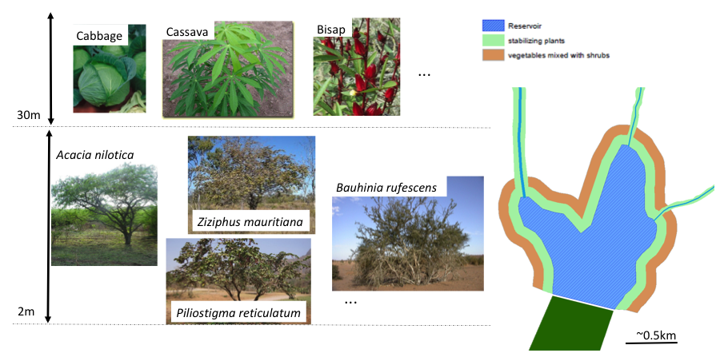
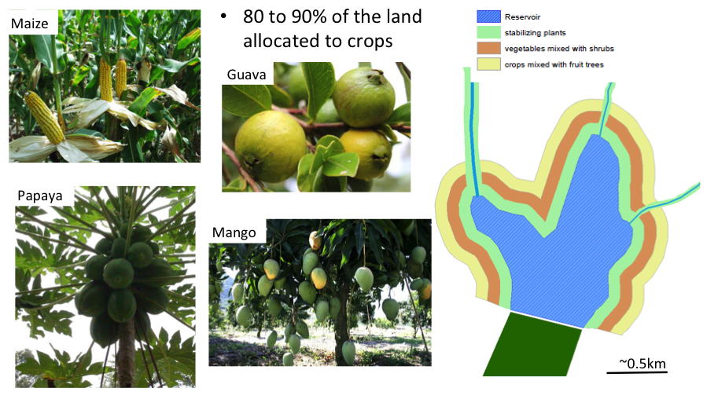

## Description of co-designed interventions

In preparation for the participatory analysis, we drafted a proposal of several intervention alternatives, based on preliminary fieldwork. These were discussed with the stakeholders in workshop plenary sessions:

1. An intervention that would exclude agriculture (including no deforestation or livestock grazing) on land within 100 meters of the reservoir and the immediate up-slope stream network. In this intervention the vegetation would also be restored to a mixed system (50% grass and 50% tree cover).

1. An intervention that would exclude agriculture and follow the same outline as the intervention described above, but with livestock grazing allowed.

1. An intervention that would permit selective agriculture on land within 100 meters of the reservoir and up-slope stream network. The agriculture would be designed to minimize erosion, including measures such as: no livestock grazing, no-till agricultural production with crop rotations, mulch applications, at least 50% perennial including trees, and wild grasses would be allowed to grow.

1.  An intervention that would seek to manually dredge part of the reservoir bed and inlet river area with arbitrary disposal of sediment elsewhere.

1. An intervention that would seek to manually dredge part of the reservoir bed and inlet river area, as the intervention above, but with targeted disposal of sand and clay layers onto nearby farmland that lacks sand or lacks clay.

1. An intervention that would seek to construct small rock check dams (these are referred to as rock dams in the main text) upstream in the channel.

1. An intervention that would promote a type of locally preferred terracing known as *fanya juu* on sloping agricultural land upstream the reservoir.

1. An intervention that would promote bench terracing upstream of the reservoir

1. An intervention that would promote no-till, or minimum tillage agriculture close to riparian zones upstream of the reservoir.

1. An intervention that would seek to manage livestock densities in riparian areas upstream of the reservoir.

## Description of intervention options designed by the group of experts

During a special workshop described in the main text, experts chose three interventions from the list above: (1) dredging along the main stream inlet; (2) building rock dams along the streams upstream; (3) implementation of a buffer protection scheme.
 
{width=500px}
 
![Permeable rock check dams as one intervention for dealing with the problem of sedimentation in the Lagdwenda reservoir of Northern Volta Basin of Burkina Faso. __a.__ Main stream upstream. Water flows occur only in case of heavy rain. __b.__ Areas to build permeable rock dams every 5 km along the stream network upstream of the reservoir (not drawn true to scale). Red lines indicate areas affected by building permeable rock dams. Red check-boxes indicate major rock check dam locations. __c.__ Example of a permeable rock dam in construction (photo provided by the Nakambé water agency).](Check dams.png){width=500px}

The third intervention proposed by the group of experts was to implement a buffer protection scheme for land around the reservoir and stream inlets. The objective of the intervention is to prevent sedimentation due to agricultural practices around the reservoir, and to reduce deposits of sediments coming from upstream.

The protection is composed of 3 buffer strips (except for land along the stream network upstream, which requires only the first buffer). The first buffer (75-100 meters) is made of stone barriers/contour bounding with stabilizing plants (grasses). The vegetation consists of grass (100% cover), delineated by stone barriers. Relevant grass species are: *Andropogon gayanus*, *Andropogon ascinodis*, *Cymbopogon ascinodis*, *Vetiveria zizanioïdes*, and *Vetiveria nigritana*. 

{width=500px} 

The second buffer (75-100 meters; Figure 12b) consists of vegetables mixed with shrubs for firewood. The  buffer consists of 20% shrub and 80 vegetables (shrubs in linear strips or scattered on the field). Possible crops are *Solanum melongena* (eggplant), *Hibiscus sabdariffa* (Roselle), *Daucus carota* (carrot), *Brassica oleracea* var *capitata* (cabbage), *Cucumis sativus* (cucumber), *Cucurbita pepo* (pumpkin), *Fragaria ananassa* (strawberry), *Hibiscus esculentus* (okra), *Phaseolus vulgaris* (common bean), *Lycopersicum esculentum* (tomato), *Lactuca sativa* (Lettuce), *Manihot esculenta* (Cassava), *Cucumis melo* (Melon), *Allium cepa* (onion), *Citrullus vulgaris* (watermelon), *lpomoea batatas* (sweet potato), *Capsicum frutescens* (chili pepper), *Capsicum annuum* (bell pepper), *Solanum tuberosum* (potato). Possible species of shrubs include: *Acacia nilotica*, *Ziziphus mauritiana*, *Bauhinia rufescens*, *Piliostigma reticulatum*, *Mimosa pigra*, *Dichrostachys cinerea* and *Dichrostachys glomerata*.

{width=500px}  

The third zone (75-100 meters) is a mix of crops with fruit trees. The buffer consists of 20 % fruit trees and 80% crops. Species of fruit trees include *Mangifera indica* (mango), *Psidium guajava* (guava), *Citrus limon* (lime), *Citrus tangelo* (tangerine), and *Carica papaya* (papaya). Regarding the crops, many common cereals such as *Zea maize* maize are included. 

{width=500px} 

To be successful, the implementation of the buffer strips intervention should be combined with techniques to reduce surface runoff (half-moon micro-catchments, application of organic rather than synthetic fertilizers), alternative strategies to access water far from the reservoir (dug wells), education action (e.g. signs to be put up around the area to raise awareness of sediment management activities) and delineation of livestock access routes to the reservoir (exact location and number of these needs to be agreed with a local experts).

